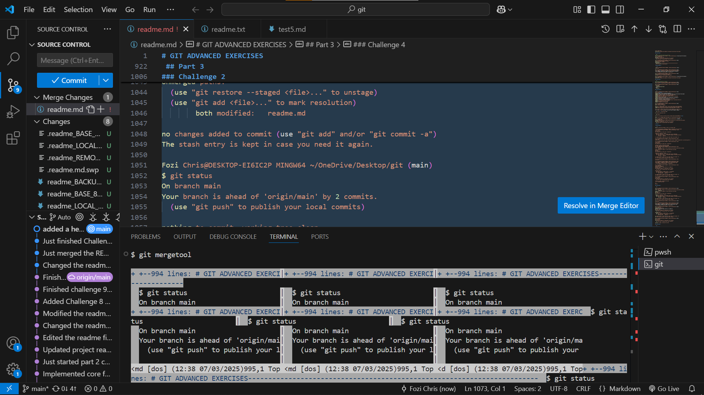

# GIT ADVANCED EXERCISES

## Part 1
 
### Challenge 1
```sh
Fozi Chris@DESKTOP-EI6IC2P MINGW64 ~/OneDrive/Desktop/git
$ touch test{1..4}.md
git add test1.md && git commit -m "chore: Create initial file"
git add test2.md && git commit -m "chore: Create another file"
git add test3.md && git commit -m "chore: Create third and fourth files"
fatal: not a git repository (or any of the parent directories): .git
fatal: not a git repository (or any of the parent directories): .git
fatal: not a git repository (or any of the parent directories): .git

Fozi Chris@DESKTOP-EI6IC2P MINGW64 ~/OneDrive/Desktop/git
$ git init
Initialized empty Git repository in C:/Users/Fozi Chris/OneDrive/Desktop/git/.git/

Fozi Chris@DESKTOP-EI6IC2P MINGW64 ~/OneDrive/Desktop/git (master)
$ git add test1.md && git commit -m "chore: Create initial file"
git add test2.md && git commit -m "chore: Create another file"
git add test3.md && git commit -m "chore: Create third and fourth files"
[master (root-commit) 8620b8e] chore: Create initial file
 1 file changed, 0 insertions(+), 0 deletions(-)
 create mode 100644 test1.md
[master 3085d76] chore: Create another file
 1 file changed, 0 insertions(+), 0 deletions(-)
 create mode 100644 test2.md
[master a1da5b3] chore: Create third and fourth files
 1 file changed, 0 insertions(+), 0 deletions(-)
 create mode 100644 test3.md

Fozi Chris@DESKTOP-EI6IC2P MINGW64 ~/OneDrive/Desktop/git (master)
$ git status
On branch master
Untracked files:
  (use "git add <file>..." to include in what will be committed)
        test4.md

nothing added to commit but untracked files present (use "git add" to track)

Fozi Chris@DESKTOP-EI6IC2P MINGW64 ~/OneDrive/Desktop/git (master)
$ git log --oneline
a1da5b3 (HEAD -> master) chore: Create third and fourth files
3085d76 chore: Create another file
8620b8e chore: Create initial file

Fozi Chris@DESKTOP-EI6IC2P MINGW64 ~/OneDrive/Desktop/git (master)
$ git add test4.md

Fozi Chris@DESKTOP-EI6IC2P MINGW64 ~/OneDrive/Desktop/git (master)
$ git commit -m 'Added the test 4 file'
[master c392fb4] Added the test 4 file
 1 file changed, 0 insertions(+), 0 deletions(-)
 create mode 100644 test4.md
 ```
### challenge 2

 ```sh
Fozi Chris@DESKTOP-EI6IC2P MINGW64 ~/OneDrive/Desktop/git (main)
$ git log --oneline
34e7879 (HEAD -> main, origin/main) Changed the readme file
c392fb4 Added the test 4 file
a1da5b3 chore: Create third and fourth files
3085d76 chore: Create another file
8620b8e chore: Create initial file

Fozi Chris@DESKTOP-EI6IC2P MINGW64 ~/OneDrive/Desktop/git (main)
$ git rebase HEAD~N
fatal: invalid upstream 'HEAD~N'

Fozi Chris@DESKTOP-EI6IC2P MINGW64 ~/OneDrive/Desktop/git (main)
$ git rebase -i HEAD~N
fatal: invalid upstream 'HEAD~N'

Fozi Chris@DESKTOP-EI6IC2P MINGW64 ~/OneDrive/Desktop/git (main)
$ git rebase -i HEAD~5
fatal: invalid upstream 'HEAD~5'

Fozi Chris@DESKTOP-EI6IC2P MINGW64 ~/OneDrive/Desktop/git (main)
$ git rebase -i HEAD ~ 1
usage: git rebase [-i] [options] [--exec <cmd>] [--onto <newbase> | --keep-base] [<upstream> [<branch>]]
   or: git rebase [-i] [options] [--exec <cmd>] [--onto <newbase>] --root [<branch>]
   or: git rebase --continue | --abort | --skip | --edit-todo

    --[no-]onto <revision>
                          rebase onto given branch instead of upstream
    --[no-]keep-base      use the merge-base of upstream and branch as the current base
    --no-verify           allow pre-rebase hook to run
    --verify              opposite of --no-verify
    -q, --[no-]quiet      be quiet. implies --no-stat
    -v, --[no-]verbose    display a diffstat of what changed upstream
    -n, --no-stat         do not show diffstat of what changed upstream
    --stat                opposite of --no-stat
    --[no-]signoff        add a Signed-off-by trailer to each commit
    --[no-]committer-date-is-author-date
                          make committer date match author date
    --[no-]reset-author-date
                          ignore author date and use current date
    -C <n>                passed to 'git apply'
    --[no-]ignore-whitespace
                          ignore changes in whitespace
    --[no-]whitespace <action>
                          passed to 'git apply'
    -f, --[no-]force-rebase
                          cherry-pick all commits, even if unchanged
    --no-ff               cherry-pick all commits, even if unchanged
    --ff                  opposite of --no-ff
    --continue            continue
    --skip                skip current patch and continue
    --abort               abort and check out the original branch
    --quit                abort but keep HEAD where it is
    --edit-todo           edit the todo list during an interactive rebase
    --show-current-patch  show the patch file being applied or merged
    --apply               use apply strategies to rebase
    -m, --merge           use merging strategies to rebase
    -i, --interactive     let the user edit the list of commits to rebase
    --[no-]rerere-autoupdate
                          update the index with reused conflict resolution if possible
    --empty (drop|keep|ask)
                          how to handle commits that become empty
    --[no-]autosquash     move commits that begin with squash!/fixup! under -i
    --[no-]update-refs    update branches that point to commits that are being rebased
    -S, --[no-]gpg-sign[=<key-id>]
                          GPG-sign commits
    --[no-]autostash      automatically stash/stash pop before and after
    -x, --[no-]exec <exec>
                          add exec lines after each commit of the editable list
    -r, --[no-]rebase-merges[=<mode>]
                          try to rebase merges instead of skipping them
    --[no-]fork-point     use 'merge-base --fork-point' to refine upstream
    -s, --[no-]strategy <strategy>
                          use the given merge strategy
    -X, --[no-]strategy-option <option>
                          pass the argument through to the merge strategy
    --[no-]root           rebase all reachable commits up to the root(s)
    --[no-]reschedule-failed-exec
                          automatically re-schedule any `exec` that fails
    --[no-]reapply-cherry-picks
                          apply all changes, even those already present upstream


Fozi Chris@DESKTOP-EI6IC2P MINGW64 ~/OneDrive/Desktop/git (main)
$ git rebase -i HEAD~1
Successfully rebased and updated refs/heads/main.
Deletion of directory '.git/rebase-merge' failed. Should I try again? (y/n) y
Deletion of directory '.git/rebase-merge' failed. Should I try again? (y/n) y
Deletion of directory '.git/rebase-merge' failed. Should I try again? (y/n) n
error: could not remove '.git/rebase-merge'

reword 3085d76 chore: Create another file
chore: Create second file
Fozi Chris@DESKTOP-EI6IC2P MINGW64 ~/OneDrive/Desktop/git (|REBASE)
$ rm -rf .git/rebase-merge

Fozi Chris@DESKTOP-EI6IC2P MINGW64 ~/OneDrive/Desktop/git (main)
$ git log --oneline
34e7879 (HEAD -> main, origin/main) Changed the readme file
c392fb4 Added the test 4 file
a1da5b3 chore: Create third and fourth files
3085d76 chore: Create another file
8620b8e chore: Create initial file

Fozi Chris@DESKTOP-EI6IC2P MINGW64 ~/OneDrive/Desktop/git (main)
$ git rebase -i HEAD~4
[detached HEAD ab1f6cb] chore: Create second file
 Date: Wed Mar 5 13:34:50 2025 +0200
 1 file changed, 0 insertions(+), 0 deletions(-)
 create mode 100644 test2.md
Successfully rebased and updated refs/heads/main.
Deletion of directory '.git/rebase-merge' failed. Should I try again? (y/n) y
Deletion of directory '.git/rebase-merge' failed. Should I try again? (y/n) y
Deletion of directory '.git/rebase-merge' failed. Should I try again? (y/n) n
error: could not remove '.git/rebase-merge'

Fozi Chris@DESKTOP-EI6IC2P MINGW64 ~/OneDrive/Desktop/git (|REBASE)
$ git log --oneline
90b847f (HEAD -> main) Changed the readme file
77a0d68 Added the test 4 file
1a9818d chore: Create third and fourth files
ab1f6cb chore: Create second file
8620b8e chore: Create initial file

Fozi Chris@DESKTOP-EI6IC2P MINGW64 ~/OneDrive/Desktop/git (|REBASE)
$ rm -rf .git/rebase-merge

Fozi Chris@DESKTOP-EI6IC2P MINGW64 ~/OneDrive/Desktop/git (main)
$ git status
On branch main
Your branch and 'origin/main' have diverged,
and have 4 and 4 different commits each, respectively.
  (use "git pull" if you want to integrate the remote branch with yours)

nothing to commit, working tree clean

Fozi Chris@DESKTOP-EI6IC2P MINGW64 ~/OneDrive/Desktop/git (main)
$ git pull
Merge made by the 'ort' strategy.

Fozi Chris@DESKTOP-EI6IC2P MINGW64 ~/OneDrive/Desktop/git (main)
$ git pull -f
Already up to date.
 ```
OUTPUT :
 Before : $ `git log --oneline`
 ```sh
34e7879 (HEAD -> main, origin/main) Changed the readme file
c392fb4 Added the test 4 file
a1da5b3 chore: Create third and fourth files
3085d76 chore: Create another file
8620b8e chore: Create initial file
After : $ git log --oneline
90b847f (HEAD -> main) Changed the readme file
77a0d68 Added the test 4 file
1a9818d chore: Create third and fourth files
ab1f6cb chore: Create second file
8620b8e chore: Create initial file
```
### challenge 3
```sh
Fozi Chris@DESKTOP-EI6IC2P MINGW64 ~/OneDrive/Desktop/git (main)
before:Fozi Chris@DESKTOP-EI6IC2P MINGW64 ~/OneDrive/Desktop/git ((90b847f...)|CHERRY-PICKING)
$ git log --oneline
90b847f (HEAD) Changed the readme file
77a0d68 Added the test 4 file
1a9818d chore: Create third and fourth files
ab1f6cb chore: Create second file
8620b8e chore: Create initial file
$ git rebase -i HEAD~2
After : Fozi Chris@DESKTOP-EI6IC2P MINGW64 ~/OneDrive/Desktop/git (main|REBASE 4/5)
$ git log --oneline
934bb38 (HEAD) Combining two commits
77a0d68 Added the test 4 file
1a9818d chore: Create third and fourth files
ab1f6cb chore: Create second file
8620b8e chore: Create initial file
```
### Challenge 4

```sh
Before reset : 
Fozi Chris@DESKTOP-EI6IC2P MINGW64 ~/OneDrive/Desktop/git (main)
$ git log --oneline
c2fc6a6 (HEAD -> main, origin/main) Edited the readme file and added the third challenge
66e48be Finished the 2nd challenge
168b261 Merge branch 'main' of https://github.com/kamufozi/git-exercises
90b847f Changed the readme file
77a0d68 Added the test 4 file
1a9818d chore: Create third and fourth files
ab1f6cb chore: Create second file
34e7879 Changed the readme file
c392fb4 Added the test 4 file
8620b8e chore: Create initial file
a1da5b3 chore: Create third and fourth files
3085d76 chore: Create another file

After reset :
Fozi Chris@DESKTOP-EI6IC2P MINGW64 ~/OneDrive/Desktop/git (main)
$  git reset --soft HEAD~6

Fozi Chris@DESKTOP-EI6IC2P MINGW64 ~/OneDrive/Desktop/git (main)
$ git add third_file.txt
git commit -m "Create Third File"
fatal: pathspec 'third_file.txt' did not match any files
[main 1280a38] Create Third File
 3 files changed, 237 insertions(+)
 create mode 100644 readme.md
 create mode 100644 test3.md
 create mode 100644 test4.md

Fozi Chris@DESKTOP-EI6IC2P MINGW64 ~/OneDrive/Desktop/git (main)
$ git push -f
Enumerating objects: 4, done.
Counting objects: 100% (4/4), done.
Delta compression using up to 8 threads
Compressing objects: 100% (3/3), done.
Writing objects: 100% (3/3), 2.58 KiB | 659.00 KiB/s, done.
Total 3 (delta 0), reused 0 (delta 0), pack-reused 0 (from 0)
To https://github.com/kamufozi/git-exercises.git
 + c2fc6a6...1280a38 main -> main (forced update)

Fozi Chris@DESKTOP-EI6IC2P MINGW64 ~/OneDrive/Desktop/git (main)
$ git log --oneline
1280a38 (HEAD -> main, origin/main) Create Third File
ab1f6cb chore: Create second file
8620b8e chore: Create initial file
##When we push and you go miles back on your commit and you reset and change the name 
##The files will come also edited with that name 
```
### Challenge 5

```sh
before merging 2 commits and naming them one : 
Fozi Chris@DESKTOP-EI6IC2P MINGW64 ~/OneDrive/Desktop/git (main)
$ git log --oneline
eaa4fec (HEAD -> main) Added the fourth challenge
1280a38 (origin/main) Create Third File
ab1f6cb chore: Create second file
8620b8e chore: Create initial file
After merging them and all the trouble I went through:
Fozi Chris@DESKTOP-EI6IC2P MINGW64 ~/OneDrive/Desktop/git (main)
$ git rebase -i HEAD~3
[detached HEAD cc9d42f] This is a combination of 2 commits that I forgot
 Date: Wed Mar 5 15:55:21 2025 +0200
 3 files changed, 289 insertions(+)
 create mode 100644 readme.md
 create mode 100644 test3.md
 create mode 100644 test4.md
Successfully rebased and updated refs/heads/main.
Deletion of directory '.git/rebase-merge' failed. Should I try again? (y/n) y
Deletion of directory '.git/rebase-merge' failed. Should I try again? (y/n) y
Deletion of directory '.git/rebase-merge' failed. Should I try again? (y/n) y
Deletion of directory '.git/rebase-merge' failed. Should I try again? (y/n) y
Deletion of directory '.git/rebase-merge' failed. Should I try again? (y/n) yyyy
Sorry, I did not understand your answer. Please type 'y' or 'n'
Deletion of directory '.git/rebase-merge' failed. Should I try again? (y/n) y
Deletion of directory '.git/rebase-merge' failed. Should I try again? (y/n) yy
Sorry, I did not understand your answer. Please type 'y' or 'n'
Deletion of directory '.git/rebase-merge' failed. Should I try again? (y/n) yy
Sorry, I did not understand your answer. Please type 'y' or 'n'
Deletion of directory '.git/rebase-merge' failed. Should I try again? (y/n) yy
Sorry, I did not understand your answer. Please type 'y' or 'n'
Deletion of directory '.git/rebase-merge' failed. Should I try again? (y/n) y
Deletion of directory '.git/rebase-merge' failed. Should I try again? (y/n) y:q
Sorry, I did not understand your answer. Please type 'y' or 'n'
Deletion of directory '.git/rebase-merge' failed. Should I try again? (y/n) :q
Sorry, I did not understand your answer. Please type 'y' or 'n'
Deletion of directory '.git/rebase-merge' failed. Should I try again? (y/n) error: could not remove '.git/rebase-merge'


Fozi Chris@DESKTOP-EI6IC2P MINGW64 ~/OneDrive/Desktop/git (|REBASE)
$ rm -rf .git/rebase-merge

Fozi Chris@DESKTOP-EI6IC2P MINGW64 ~/OneDrive/Desktop/git (main)
$ git status
On branch main
Your branch and 'origin/main' have diverged,
and have 1 and 1 different commits each, respectively.
  (use "git pull" if you want to integrate the remote branch with yours)

nothing to commit, working tree clean

Fozi Chris@DESKTOP-EI6IC2P MINGW64 ~/OneDrive/Desktop/git (main)
$ git pull
Auto-merging readme.md
CONFLICT (add/add): Merge conflict in readme.md
Automatic merge failed; fix conflicts and then commit the result.

Fozi Chris@DESKTOP-EI6IC2P MINGW64 ~/OneDrive/Desktop/git (main|MERGING)
$ git merge --abort

Fozi Chris@DESKTOP-EI6IC2P MINGW64 ~/OneDrive/Desktop/git (main)
$ git add .

Fozi Chris@DESKTOP-EI6IC2P MINGW64 ~/OneDrive/Desktop/git (main)
$ git status
On branch main
Your branch and 'origin/main' have diverged,
and have 1 and 1 different commits each, respectively.
  (use "git pull" if you want to integrate the remote branch with yours)

nothing to commit, working tree clean

Fozi Chris@DESKTOP-EI6IC2P MINGW64 ~/OneDrive/Desktop/git (main)
$ git pull
Auto-merging readme.md
CONFLICT (add/add): Merge conflict in readme.md
Automatic merge failed; fix conflicts and then commit the result.

Fozi Chris@DESKTOP-EI6IC2P MINGW64 ~/OneDrive/Desktop/git (main|MERGING)
$ git push -f
Enumerating objects: 4, done.
Counting objects: 100% (4/4), done.
Delta compression using up to 8 threads
Compressing objects: 100% (3/3), done.
Writing objects: 100% (3/3), 3.09 KiB | 1.03 MiB/s, done.
Total 3 (delta 0), reused 0 (delta 0), pack-reused 0 (from 0)
To https://github.com/kamufozi/git-exercises.git
 + 1280a38...cc9d42f main -> main (forced update)

Fozi Chris@DESKTOP-EI6IC2P MINGW64 ~/OneDrive/Desktop/git (main|MERGING)
$ git merge --abort

Fozi Chris@DESKTOP-EI6IC2P MINGW64 ~/OneDrive/Desktop/git (main)
$ git status
On branch main
Your branch is up to date with 'origin/main'.

nothing to commit, working tree clean

Fozi Chris@DESKTOP-EI6IC2P MINGW64 ~/OneDrive/Desktop/git (main)
$ git oneline
git: 'oneline' is not a git command. See 'git --help'.

Fozi Chris@DESKTOP-EI6IC2P MINGW64 ~/OneDrive/Desktop/git (main)
$ git log --oneline
cc9d42f (HEAD -> main, origin/main) This is a combination of 2 commits that I forgot
ab1f6cb chore: Create second file
8620b8e chore: Create initial file
```
### Challenge 6

```sh
Fozi Chris@DESKTOP-EI6IC2P MINGW64 ~/OneDrive/Desktop/git (main)
$ git log --oneline
b36d350 (HEAD -> main, origin/main) Hehe I commited this changes
cc9d42f This is a combination of 2 commits that I forgot
drop ab1f6cb chore: Create second file
ab1f6cb chore: Create second file
8620b8e chore: Create initial file

Fozi Chris@DESKTOP-EI6IC2P MINGW64 ~/OneDrive/Desktop/git (main)
$ git rebase -i HEAD~4
fatal: invalid upstream 'HEAD~4'

Fozi Chris@DESKTOP-EI6IC2P MINGW64 ~/OneDrive/Desktop/git (main)
$ git rebase -i HEAD~4
fatal: invalid upstream 'HEAD~4'

Fozi Chris@DESKTOP-EI6IC2P MINGW64 ~/OneDrive/Desktop/git (main)
$ git rebase -i HEAD~3
Successfully rebased and updated refs/heads/main.
Deletion of directory '.git/rebase-merge' failed. Should I try again? (y/n) y
Deletion of directory '.git/rebase-merge' failed. Should I try again? (y/n) y
Deletion of directory '.git/rebase-merge' failed. Should I try again? (y/n) y
Deletion of directory '.git/rebase-merge' failed. Should I try again? (y/n) error: could not remove '.git/rebase-merge'


Fozi Chris@DESKTOP-EI6IC2P MINGW64 ~/OneDrive/Desktop/git (|REBASE)
$ rm -rf .git/rebase-merge

Fozi Chris@DESKTOP-EI6IC2P MINGW64 ~/OneDrive/Desktop/git (main)
$ git log --oneline
fbc93cb (HEAD -> main) Hehe I commited this changes
12eb0c9 This is a combination of 2 commits that I forgot
8620b8e chore: Create initial file

Fozi Chris@DESKTOP-EI6IC2P MINGW64 ~/OneDrive/Desktop/git (main)
$ git status
On branch main
Your branch and 'origin/main' have diverged,
and have 2 and 3 different commits each, respectively.
  (use "git pull" if you want to integrate the remote branch with yours)

nothing to commit, working tree clean

Fozi Chris@DESKTOP-EI6IC2P MINGW64 ~/OneDrive/Desktop/git (main)
$ git add .

Fozi Chris@DESKTOP-EI6IC2P MINGW64 ~/OneDrive/Desktop/git (main)
$ git push -f
Enumerating objects: 7, done.
Counting objects: 100% (7/7), done.
Delta compression using up to 8 threads
Compressing objects: 100% (6/6), done.
Writing objects: 100% (6/6), 3.76 KiB | 1.88 MiB/s, done.
Total 6 (delta 1), reused 0 (delta 0), pack-reused 0 (from 0)
remote: Resolving deltas: 100% (1/1), done.
To https://github.com/kamufozi/git-exercises.git
 + b36d350...fbc93cb main -> main (forced update)
 
Before dropping one commit:
$ git log --oneline
b36d350 (HEAD -> main, origin/main) Hehe I commited this changes
cc9d42f This is a combination of 2 commits that I forgot
drop ab1f6cb chore: Create second file
ab1f6cb chore: Create second file
8620b8e chore: Create initial file

After dropping the bitch:
Fozi Chris@DESKTOP-EI6IC2P MINGW64 ~/OneDrive/Desktop/git (main)
$ git log --oneline
fbc93cb (HEAD -> main) Hehe I commited this changes
12eb0c9 This is a combination of 2 commits that I forgot
8620b8e chore: Create initial file
```
### Challenge 7

```sh
Before Reordering using git rebase:
Fozi Chris@DESKTOP-EI6IC2P MINGW64 ~/OneDrive/Desktop/git (main)
$ git log --oneline
81cb680 (HEAD -> main, origin/main, newBranch) Added an html file
5c041fe Checking to see something
561713e Finished challenge 6
a97f053 Added file
fbc93cb Hehe I commited this changes
12eb0c9 This is a combination of 2 commits that I forgot
8620b8e chore: Create initial file
After Reordering :
Fozi Chris@DESKTOP-EI6IC2P MINGW64 ~/OneDrive/Desktop/git (main)
$ git log --oneline
3843d9c (HEAD -> main) Just edited the readme file
d7d22ef Added an html file
23b8fed Finished challenge 6
2f861d4 Checking to see something
1eb964c Hehe I commited this changes
63b0964 Added file
12eb0c9 This is a combination of 2 commits that I forgot
8620b8e chore: Create initial file
## The way we do this is we rebase where we want and after rebasing we to the commit we want we type
## dd and it copies that line and then we move the cursor where we want to go and then we paste from there and it done this is how we reorder
```
### Challenge 8

```sh
Before cherry-picking from ft/branch:
9598812 (HEAD -> main, origin/main) Finished the 7th challenge
3843d9c Just edited the readme file
d7d22ef Added an html file
23b8fed Finished challenge 6
2f861d4 Checking to see something
1eb964c Hehe I commited this changes
63b0964 Added file
12eb0c9 This is a combination of 2 commits that I forgot
8620b8e chore: Create initial file

The ft/bundle commit :  b1353ba (ft/branch) Implemented the test 5 file

commands used  : 
Fozi Chris@DESKTOP-EI6IC2P MINGW64 ~/OneDrive/Desktop/git (main)
$ git branch ft/branch

Fozi Chris@DESKTOP-EI6IC2P MINGW64 ~/OneDrive/Desktop/git (main)
$ git checkout ft/branch
M       readme.md
Switched to branch 'ft/branch'

Fozi Chris@DESKTOP-EI6IC2P MINGW64 ~/OneDrive/Desktop/git (ft/branch)
$ touch test5.md

Fozi Chris@DESKTOP-EI6IC2P MINGW64 ~/OneDrive/Desktop/git (ft/branch)
$ git add test5.md

Fozi Chris@DESKTOP-EI6IC2P MINGW64 ~/OneDrive/Desktop/git (ft/branch)
$ git commit -m 'Implemented the test 5 file'
[ft/branch b1353ba] Implemented the test 5 file
 1 file changed, 1 insertion(+)
 create mode 100644 test5.md

Fozi Chris@DESKTOP-EI6IC2P MINGW64 ~/OneDrive/Desktop/git (ft/branch)
$ git checkout main
M       readme.md
Switched to branch 'main'
Your branch is up to date with 'origin/main'.

Fozi Chris@DESKTOP-EI6IC2P MINGW64 ~/OneDrive/Desktop/git (main)
$ git log --oneline
9598812 (HEAD -> main, origin/main) Finished the 7th challenge
3843d9c Just edited the readme file
d7d22ef Added an html file
23b8fed Finished challenge 6
2f861d4 Checking to see something
1eb964c Hehe I commited this changes
63b0964 Added file
12eb0c9 This is a combination of 2 commits that I forgot
8620b8e chore: Create initial file

Fozi Chris@DESKTOP-EI6IC2P MINGW64 ~/OneDrive/Desktop/git (main)
$ git checkout ft/bundle
error: pathspec 'ft/bundle' did not match any file(s) known to git

Fozi Chris@DESKTOP-EI6IC2P MINGW64 ~/OneDrive/Desktop/git (main)
$ git branch
  ft/branch
* main
  newBranch

Fozi Chris@DESKTOP-EI6IC2P MINGW64 ~/OneDrive/Desktop/git (main)
$ git log --oneline ft/branch
b1353ba (ft/branch) Implemented the test 5 file
9598812 (HEAD -> main, origin/main) Finished the 7th challenge
3843d9c Just edited the readme file
d7d22ef Added an html file
23b8fed Finished challenge 6
2f861d4 Checking to see something
1eb964c Hehe I commited this changes
63b0964 Added file
12eb0c9 This is a combination of 2 commits that I forgot
8620b8e chore: Create initial file

Fozi Chris@DESKTOP-EI6IC2P MINGW64 ~/OneDrive/Desktop/git (main)
$ git log --oneline
9598812 (HEAD -> main, origin/main) Finished the 7th challenge
3843d9c Just edited the readme file
d7d22ef Added an html file
23b8fed Finished challenge 6
2f861d4 Checking to see something
1eb964c Hehe I commited this changes
63b0964 Added file
12eb0c9 This is a combination of 2 commits that I forgot
8620b8e chore: Create initial file

Fozi Chris@DESKTOP-EI6IC2P MINGW64 ~/OneDrive/Desktop/git (main)
$ git cherry-pick b1353ba
[main 82f0f86] Implemented the test 5 file
 Date: Thu Mar 6 16:04:02 2025 +0200
 1 file changed, 1 insertion(+)
 create mode 100644 test5.md

Fozi Chris@DESKTOP-EI6IC2P MINGW64 ~/OneDrive/Desktop/git (main)
$ git log --oneline
82f0f86 (HEAD -> main) Implemented the test 5 file
9598812 (origin/main) Finished the 7th challenge
3843d9c Just edited the readme file
d7d22ef Added an html file
23b8fed Finished challenge 6
2f861d4 Checking to see something
1eb964c Hehe I commited this changes
63b0964 Added file
12eb0c9 This is a combination of 2 commits that I forgot
8620b8e chore: Create initial file

Fozi Chris@DESKTOP-EI6IC2P MINGW64 ~/OneDrive/Desktop/git (main)
$ git push
Enumerating objects: 4, done.
Counting objects: 100% (4/4), done.
Delta compression using up to 8 threads
Compressing objects: 100% (2/2), done.
Writing objects: 100% (3/3), 298 bytes | 298.00 KiB/s, done.
Total 3 (delta 1), reused 0 (delta 0), pack-reused 0 (from 0)
remote: Resolving deltas: 100% (1/1), completed with 1 local object.
To https://github.com/kamufozi/git-exercises.git
   9598812..82f0f86  main -> main

After Cherry-picking:
Fozi Chris@DESKTOP-EI6IC2P MINGW64 ~/OneDrive/Desktop/git (main)
$ git log --oneline
82f0f86 (HEAD -> main, origin/main) Implemented the test 5 file
9598812 Finished the 7th challenge
3843d9c Just edited the readme file
d7d22ef Added an html file
23b8fed Finished challenge 6
2f861d4 Checking to see something
1eb964c Hehe I commited this changes
63b0964 Added file
12eb0c9 This is a combination of 2 commits that I forgot
8620b8e chore: Create initial file.
```
### Challenge 9

```sh
git log --graph --oneline --all comes to show all the commits to help one visualize how the history is shaped:
Fozi Chris@DESKTOP-EI6IC2P MINGW64 ~/OneDrive/Desktop/git (main)
$ git log --graph --oneline --all
* 4639f01 (HEAD -> main, origin/main) Just finished the 8th challenge
* 82f0f86 Implemented the test 5 file
| * b1353ba (ft/branch) Implemented the test 5 file
|/
* 9598812 Finished the 7th challenge
* 3843d9c Just edited the readme file
* d7d22ef Added an html file
* 23b8fed Finished challenge 6
* 2f861d4 Checking to see something
* 1eb964c Hehe I commited this changes
* 63b0964 Added file
| * 81cb680 (newBranch) Added an html file
| * 5c041fe Checking to see something 
OR

Fozi Chris@DESKTOP-EI6IC2P MINGW64 ~/OneDrive/Desktop/git (main)
$ git log --graph --pretty=format:'%C(yellow)%h%C(reset) - %C(cyan)%s %C(green)(%cr) %C(reset) [%C(bold blue)%an%C(reset)]' --all
* 4639f01 - Just finished the 8th challenge (7 minutes ago)  [Fozi Chris]
* 82f0f86 - Implemented the test 5 file (9 minutes ago)  [Fozi Chris]
| * b1353ba - Implemented the test 5 file (16 minutes ago)  [Fozi Chris]
|/
* 9598812 - Finished the 7th challenge (24 minutes ago)  [Fozi Chris]
* 3843d9c - Just edited the readme file (26 minutes ago)  [Fozi Chris]
* d7d22ef - Added an html file (26 minutes ago)  [Fozi Chris]
* 23b8fed - Finished challenge 6 (26 minutes ago)  [Fozi Chris]
* 2f861d4 - Checking to see something (26 minutes ago)  [Fozi Chris]
* 1eb964c - Hehe I commited this changes (26 minutes ago)  [Fozi Chris]
* 63b0964 - Added file (26 minutes ago)  [Fozi Chris]
| * 81cb680 - Added an html file (56 minutes ago)  [Fozi Chris]
| * 5c041fe - Checking to see something (56 minutes ago)  [Fozi Chris]
```
### Challenge 10

```sh
I understand how git reflog work basically helps you see the recent HEADS and commits and allows you to put something in 
the git reset so as to go back this also happened to me while I was working on git rebase and I kept losing my data I would 
git reflog and then restore my data.

```

## Part 2

### Challenge 1
```sh
Fozi Chris@DESKTOP-EI6IC2P MINGW64 ~/OneDrive/Desktop/git (main)
$ git branch ft/new-feature

Fozi Chris@DESKTOP-EI6IC2P MINGW64 ~/OneDrive/Desktop/git (main)
$ git checkout ft/new-feature
M       readme.md
Switched to branch 'ft/new-feature'

Fozi Chris@DESKTOP-EI6IC2P MINGW64 ~/OneDrive/Desktop/git (ft/new-feature)
$
```
### Challenge 2

```sh
Fozi Chris@DESKTOP-EI6IC2P MINGW64 ~/OneDrive/Desktop/git (ft/new-feature)
$ touch feature.txt

Fozi Chris@DESKTOP-EI6IC2P MINGW64 ~/OneDrive/Desktop/git (ft/new-feature)
$ git add .

Fozi Chris@DESKTOP-EI6IC2P MINGW64 ~/OneDrive/Desktop/git (ft/new-feature)
$ git commit -m 'Implemented core functionality for new feature'
[ft/new-feature 06af18b] Implemented core functionality for new feature
 2 files changed, 23 insertions(+), 1 deletion(-)
 create mode 100644 feature.txt
 ```
 ### Challenge 3

 ```sh
 Fozi Chris@DESKTOP-EI6IC2P MINGW64 ~/OneDrive/Desktop/git (ft/new-feature)
$ git checkout main
Switched to branch 'main'
Your branch is up to date with 'origin/main'.

Fozi Chris@DESKTOP-EI6IC2P MINGW64 ~/OneDrive/Desktop/git (main)
$ touch readme.txt

Fozi Chris@DESKTOP-EI6IC2P MINGW64 ~/OneDrive/Desktop/git (main)
$ git add .

Fozi Chris@DESKTOP-EI6IC2P MINGW64 ~/OneDrive/Desktop/git (main)
$ git commit -m 'Updated project readme'
[main 0def841] Updated project readme
 1 file changed, 1 insertion(+)
 create mode 100644 readme.txt
 ```
 ### Challenge 4

 ```sh
 Fozi Chris@DESKTOP-EI6IC2P MINGW64 ~/OneDrive/Desktop/git (main)
$ git checkout ft/new-feature
Switched to branch 'ft/new-feature'

Fozi Chris@DESKTOP-EI6IC2P MINGW64 ~/OneDrive/Desktop/git (ft/new-feature)
$ git push origin ft/new-feature
Enumerating objects: 9, done.
Counting objects: 100% (9/9), done.
Delta compression using up to 8 threads
Compressing objects: 100% (6/6), done.
Writing objects: 100% (7/7), 884 bytes | 221.00 KiB/s, done.
Total 7 (delta 4), reused 0 (delta 0), pack-reused 0 (from 0)
remote: Resolving deltas: 100% (4/4), completed with 2 local objects.
remote:
remote: Create a pull request for 'ft/new-feature' on GitHub by visiting:
remote:      https://github.com/kamufozi/git-exercises/pull/new/ft/new-feature
remote:
To https://github.com/kamufozi/git-exercises.git
 * [new branch]      ft/new-feature -> ft/new-feature
 ```
 ### Challenge 5
 ```sh
 Fozi Chris@DESKTOP-EI6IC2P MINGW64 ~/OneDrive/Desktop/git (ft/new-feature)
$ git checkout main
Switched to branch 'main'
Your branch is ahead of 'origin/main' by 1 commit.
  (use "git push" to publish your local commits)
## Merged the other branch to my main
Fozi Chris@DESKTOP-EI6IC2P MINGW64 ~/OneDrive/Desktop/git (main)
$ git rebase ft/new-feature
Successfully rebased and updated refs/heads/main.
##Deleted the branch
Fozi Chris@DESKTOP-EI6IC2P MINGW64 ~/OneDrive/Desktop/git (main)
$ git branch -d ft/new-feature
Deleted branch ft/new-feature (was 2e28ebe).
```
### Challenge 6

```sh
Fozi Chris@DESKTOP-EI6IC2P MINGW64 ~/OneDrive/Desktop/git (main)
$ git log --oneline
f01bdc9 (HEAD -> main) Updated project readme
2e28ebe (origin/ft/new-feature) Just started part 2 challenge 3
06af18b Implemented core functionality for new feature
97293a2 (origin/main) Added challenge 10
510d351 Finished 8th challenge and understood git log grapp oneline all
4639f01 Just finished the 8th challenge
82f0f86 Implemented the test 5 file
9598812 Finished the 7th challenge
3843d9c Just edited the readme file
d7d22ef Added an html file
23b8fed Finished challenge 6
2f861d4 Checking to see something
1eb964c Hehe I commited this changes

Fozi Chris@DESKTOP-EI6IC2P MINGW64 ~/OneDrive/Desktop/git (main)
$ git checkout -b ft/new-branch-from-commit 06af18b
error: Your local changes to the following files would be overwritten by checkout:
        readme.md
Please commit your changes or stash them before you switch branches.
Aborting

Fozi Chris@DESKTOP-EI6IC2P MINGW64 ~/OneDrive/Desktop/git (main)
$ git add .

Fozi Chris@DESKTOP-EI6IC2P MINGW64 ~/OneDrive/Desktop/git (main)
$ git checkout -b ft/new-branch-from-commit 06af18b
error: Your local changes to the following files would be overwritten by checkout:
        readme.md
Please commit your changes or stash them before you switch branches.
Aborting

Fozi Chris@DESKTOP-EI6IC2P MINGW64 ~/OneDrive/Desktop/git (main)
$ git commit -m 'Edited the readme file and added differenct challenges'
[main 87d2204] Edited the readme file and added differenct challenges
 1 file changed, 59 insertions(+), 1 deletion(-)

Fozi Chris@DESKTOP-EI6IC2P MINGW64 ~/OneDrive/Desktop/git (main)
$ git checkout -b ft/new-branch-from-commit 06af18b
Switched to a new branch 'ft/new-branch-from-commit'

Fozi Chris@DESKTOP-EI6IC2P MINGW64 ~/OneDrive/Desktop/git (ft/new-branch-from-commit)
$ git rebase main
Successfully rebased and updated refs/heads/ft/new-branch-from-commit.
```
### Challenge 7

```sh
##merging the other branch into the main
Fozi Chris@DESKTOP-EI6IC2P MINGW64 ~/OneDrive/Desktop/git (ft/new-branch-from-commit)
$ git checkout main
Switched to branch 'main'
Your branch is ahead of 'origin/main' by 4 commits.
  (use "git push" to publish your local commits)

Fozi Chris@DESKTOP-EI6IC2P MINGW64 ~/OneDrive/Desktop/git (main)
$ git merge ft/new-branch-from-commit
Updating 87d2204..8179ed8
Fast-forward
 readme.md | 45 +++++++++++++++++++++++++++++++++++++++++++++
 1 file changed, 45 insertions(+)
 ```
 ### Challenge 8

 ```sh
 Fozi Chris@DESKTOP-EI6IC2P MINGW64 ~/OneDrive/Desktop/git (main)
$ git add .

Fozi Chris@DESKTOP-EI6IC2P MINGW64 ~/OneDrive/Desktop/git (main)
$ git commit -m 'Modified the readme file and started challenge 8'
[main 7004003] Modified the readme file and started challenge 8
 1 file changed, 23 insertions(+), 1 deletion(-)

Fozi Chris@DESKTOP-EI6IC2P MINGW64 ~/OneDrive/Desktop/git (main)
$ git checkout ft/new-branch-from-commit
Switched to branch 'ft/new-branch-from-commit'

Fozi Chris@DESKTOP-EI6IC2P MINGW64 ~/OneDrive/Desktop/git (ft/new-branch-from-commit)
$ git rebase main
Successfully rebased and updated refs/heads/ft/new-branch-from-commit.
```
### Challenge 9

```sh
##To change the name of a branch :
Fozi Chris@DESKTOP-EI6IC2P MINGW64 ~/OneDrive/Desktop/git (main)
$ git branch -m ft/new-branch-from-commit ft/improved-branch-name

Fozi Chris@DESKTOP-EI6IC2P MINGW64 ~/OneDrive/Desktop/git (main)
$ git branch
  ft/branch
  ft/improved-branch-name
* main
  newBranch
```
### Challenge 10

```sh
Fozi Chris@DESKTOP-EI6IC2P MINGW64 ~/OneDrive/Desktop/git (main)
$ git log --oneline
82e372b (HEAD -> main) Finished challenge 9
a248809 (ft/improved-branch-name) Added Challenge 8 on ft/new-branch-from-commit
7004003 Modified the readme file and started challenge 8
8179ed8 Changed the readme file in another branch
87d2204 Edited the readme file and added differenct challenges
f01bdc9 Updated project readme
2e28ebe (origin/ft/new-feature) Just started part 2 challenge 3
06af18b Implemented core functionality for new feature
97293a2 (origin/main) Added challenge 10
510d351 Finished 8th challenge and understood git log grapp oneline all
4639f01 Just finished the 8th challenge
82f0f86 Implemented the test 5 file
9598812 Finished the 7th challenge

Fozi Chris@DESKTOP-EI6IC2P MINGW64 ~/OneDrive/Desktop/git (main)
$ git checkout a248809
Note: switching to 'a248809'.

You are in 'detached HEAD' state. You can look around, make experimental
changes and commit them, and you can discard any commits you make in this
state without impacting any branches by switching back to a branch.

If you want to create a new branch to retain commits you create, you may
do so (now or later) by using -c with the switch command. Example:

  git switch -c <new-branch-name>

Or undo this operation with:

  git switch -

Turn off this advice by setting config variable advice.detachedHead to false

HEAD is now at a248809 Added Challenge 8 on ft/new-branch-from-commit

Fozi Chris@DESKTOP-EI6IC2P MINGW64 ~/OneDrive/Desktop/git ((a248809...))
$ git checkout main
Previous HEAD position was a248809 Added Challenge 8 on ft/new-branch-from-commit
Switched to branch 'main'
Your branch is ahead of 'origin/main' by 8 commits.
  (use "git push" to publish your local commits)
   ```
 ## Part 3

 ### Challenge 1

 ```sh
Hello I'm doing some changes so that I can commit them.

 The codes that shows I stashed my changes I had made on the main Branch
 Fozi Chris@DESKTOP-EI6IC2P MINGW64 ~/OneDrive/Desktop/git (main)
$ git status
On branch main
Your branch is up to date with 'origin/main'.

Changes not staged for commit:
  (use "git add <file>..." to update what will be committed)
  (use "git restore <file>..." to discard changes in working directory)
        modified:   readme.md

no changes added to commit (use "git add" and/or "git commit -a")

Fozi Chris@DESKTOP-EI6IC2P MINGW64 ~/OneDrive/Desktop/git (main)
$ git stash
Saved working directory and index state WIP on main: ac1ad78 Finished Part 2 and Starting Part 3

Fozi Chris@DESKTOP-EI6IC2P MINGW64 ~/OneDrive/Desktop/git (main)
$ git status
On branch main
Your branch is up to date with 'origin/main'.

nothing to commit, working tree clean
The codes that show I git stash poped 
Fozi Chris@DESKTOP-EI6IC2P MINGW64 ~/OneDrive/Desktop/git (main)
$ git stash pop
error: Your local changes to the following files would be overwritten by merge:
        readme.md
Please commit your changes or stash them before you merge.
Aborting
On branch main
Your branch is up to date with 'origin/main'.

Changes not staged for commit:
  (use "git add <file>..." to update what will be committed)
  (use "git restore <file>..." to discard changes in working directory)
        modified:   readme.md

no changes added to commit (use "git add" and/or "git commit -a")
The stash entry is kept in case you need it again.

Fozi Chris@DESKTOP-EI6IC2P MINGW64 ~/OneDrive/Desktop/git (main)
$ git add .

Fozi Chris@DESKTOP-EI6IC2P MINGW64 ~/OneDrive/Desktop/git (main)
$ git commit -m 'Changed the readme file to show the git stash'
[main 0b810fc] Changed the readme file to show the git stash
 1 file changed, 25 insertions(+), 1 deletion(-)

Fozi Chris@DESKTOP-EI6IC2P MINGW64 ~/OneDrive/Desktop/git (main)
$ git stash pop
Auto-merging readme.md
CONFLICT (content): Merge conflict in readme.md
On branch main
Your branch is ahead of 'origin/main' by 1 commit.
  (use "git push" to publish your local commits)

Unmerged paths:
  (use "git restore --staged <file>..." to unstage)
  (use "git add <file>..." to mark resolution)
        both modified:   readme.md

no changes added to commit (use "git add" and/or "git commit -a")
The stash entry is kept in case you need it again.

Fozi Chris@DESKTOP-EI6IC2P MINGW64 ~/OneDrive/Desktop/git (main)
$ git status
On branch main
Your branch is ahead of 'origin/main' by 2 commits.
  (use "git push" to publish your local commits)

nothing to commit, working tree clean
 ```
### Challenge 2 

```sh

Fozi Chris@DESKTOP-EI6IC2P MINGW64 ~/OneDrive/Desktop/git (main)
$ git stash pop
error: Your local changes to the following files would be overwritten by merge:
        readme.md
Please commit your changes or stash them before you merge.
Aborting
On branch main
Your branch is up to date with 'origin/main'.

Changes not staged for commit:
  (use "git add <file>..." to update what will be committed)
  (use "git restore <file>..." to discard changes in working directory)
        modified:   readme.md

no changes added to commit (use "git add" and/or "git commit -a")
The stash entry is kept in case you need it again.

Fozi Chris@DESKTOP-EI6IC2P MINGW64 ~/OneDrive/Desktop/git (main)
$ git add .

Fozi Chris@DESKTOP-EI6IC2P MINGW64 ~/OneDrive/Desktop/git (main)
$ git commit -m 'Changed the readme file to show the git stash'
[main 0b810fc] Changed the readme file to show the git stash
 1 file changed, 25 insertions(+), 1 deletion(-)

Fozi Chris@DESKTOP-EI6IC2P MINGW64 ~/OneDrive/Desktop/git (main)
$ git stash pop
Auto-merging readme.md
CONFLICT (content): Merge conflict in readme.md
On branch main
Your branch is ahead of 'origin/main' by 1 commit.
  (use "git push" to publish your local commits)

Unmerged paths:
  (use "git restore --staged <file>..." to unstage)
  (use "git add <file>..." to mark resolution)
        both modified:   readme.md

no changes added to commit (use "git add" and/or "git commit -a")
The stash entry is kept in case you need it again.

Fozi Chris@DESKTOP-EI6IC2P MINGW64 ~/OneDrive/Desktop/git (main)
$ git status
On branch main
Your branch is ahead of 'origin/main' by 2 commits.
  (use "git push" to publish your local commits)

nothing to commit, working tree clean
```
### Challenge 3

```sh

Merged the changes I had made on the readme file on the stash and what wasn't stashed.

```

### Challenge 4

```sh

### Going to make another merge conflict

Made it by stashing changes on main branch and then putting other changes on top of it 

the git mergetool was evasive I did not understand how it works.
```

